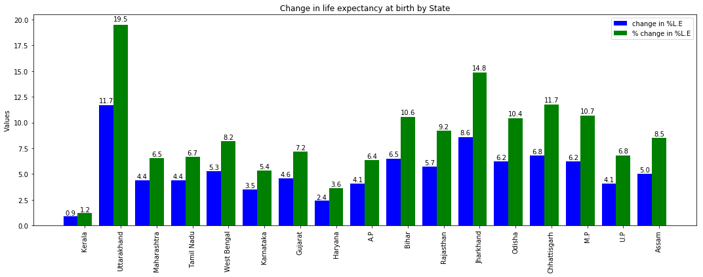

# Change-in-Life-Expectancy-at-Birth-by-Indian-States
The wikipedia page https://en.wikipedia.org/wiki/List_of_Indian_states_by_life_expectancy_at_birth has state-wise data for Life Expectancy at birth (l.e.b) for the periods 2002-2006 and 2010-2014. While the values are very well presented, the data does not give the full picture in terms of the change in l.e.b between the 2002-2006 and 2010-2014 periods. The below chart attempts to fulfill the same:

Note that l.e.b itself is a percentage value, so l.e.b --> % l.e.b

In the bar plot, states have been sorted in descending order of their l.e.b in 2002-2006.
Eg: Kerala had the maximum l.e.b between 2002-2006, followed by Maharashtra and so on.

The chart attempts to communicate the below:
1) The relative l.e.b values of states in the 2002-2006 period (as the x-axis labels are sorted in this order)
2) The extent of increase in l.e.b values for each state (represented by the blue bars)
3) The extent of increase in l.e.b of a state in 2010-2014 as compared to the l.e.b value in 2002-2006 (represented by the green bars)

From the plot, it is clear that Kerala,which had the maximum l.e.b in 2002-2006, had the least increase in l.e.b in 2010-2014, while Uttarakhand had the maximum increase in l.e.b (12%) which was about 20% higher than it's l.e.b value in 2002-2006.

A note on the data:
The data source ONLY includes states where this information was available. Additionally, Delhi and Jammu and Kashmir only had data for 2010-2014 but no data for 2002-2006, so they have also been excluded from the plot.

